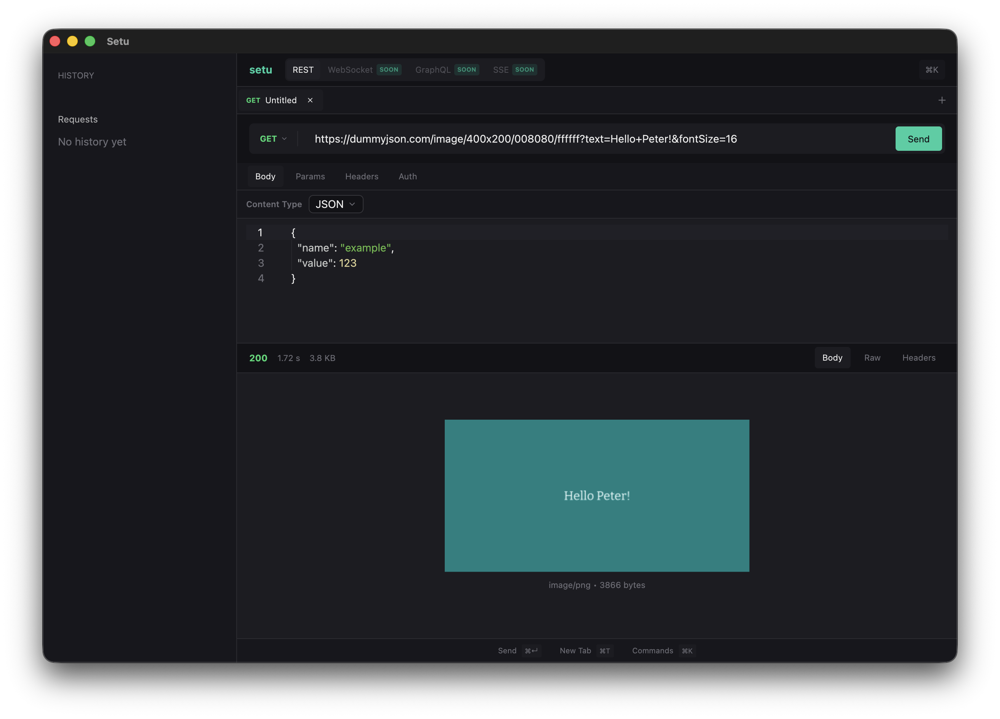

# Setu

> **Note:** This project is currently a **Work in Progress (WIP)**.

**Setu** is a modern, minimal, and high-performance API testing application built with Rust and [GPUI](https://gpui.rs).



## Getting Started

Ensure you have [Rust](https://www.rust-lang.org/tools/install) installed on your system.

1. **Clone the repository:**

   ```bash
   git clone https://github.com/bajrangCoder/setu.git
   cd setu
   ```

2. **Run the application:**
   ```bash
   cargo run
   ```

## Keyboard Shortcuts

Setu is designed for keyboard-first interactivity. Here are the available shortcuts:

### Request Actions

| Shortcut    | Action            |
| ----------- | ----------------- |
| `⌘↵` / `⌃↵` | Send Request      |
| `⌘N`        | New Tab/Request   |
| `⌘D`        | Duplicate Request |

### Tab Navigation

| Shortcut      | Action            |
| ------------- | ----------------- |
| `⌃⇥`          | Next Tab          |
| `⌘⇧]` / `⌥⌘→` | Next Tab          |
| `⌃⇧⇥`         | Previous Tab      |
| `⌘⇧[` / `⌥⌘←` | Previous Tab      |
| `⌘W`          | Close Tab         |
| `⌘⇧W`         | Close All Tabs    |
| `⌘⌥W`         | Close Other Tabs  |
| `⌘1` - `⌘8`   | Go to Tab 1-8     |
| `⌘9`          | Go to Last Tab    |

### Panel Navigation

| Shortcut    | Action                     |
| ----------- | -------------------------- |
| `⌘L` / `⌘U` | Focus URL Bar              |
| `⌘⇧B`       | Switch to Body Tab         |
| `⌘⇧P`       | Switch to Params Tab       |
| `⌘⇧H`       | Switch to Headers Tab      |
| `⌘⇧A`       | Switch to Auth Tab         |
| `⌘⌥B`       | Switch to Response Body    |
| `⌘⌥H`       | Switch to Response Headers |

### UI Toggles

| Shortcut    | Action            |
| ----------- | ----------------- |
| `⌘K` / `⌘P` | Command Palette   |
| `⌘B` / `⌘\` | Toggle Sidebar    |

### HTTP Method Shortcuts

| Shortcut | Method  |
| -------- | ------- |
| `⌥G`     | GET     |
| `⌥P`     | POST    |
| `⌥U`     | PUT     |
| `⌥D`     | DELETE  |
| `⌥A`     | PATCH   |
| `⌥H`     | HEAD    |
| `⌥O`     | OPTIONS |

### Application

| Shortcut | Action |
| -------- | ------ |
| `⌘Q`     | Quit   |

### Symbol Legend

- `⌘` = Command (Cmd)
- `⌃` = Control (Ctrl)
- `⌥` = Option (Alt)
- `⇧` = Shift
- `⇥` = Tab
- `↵` = Enter/Return
