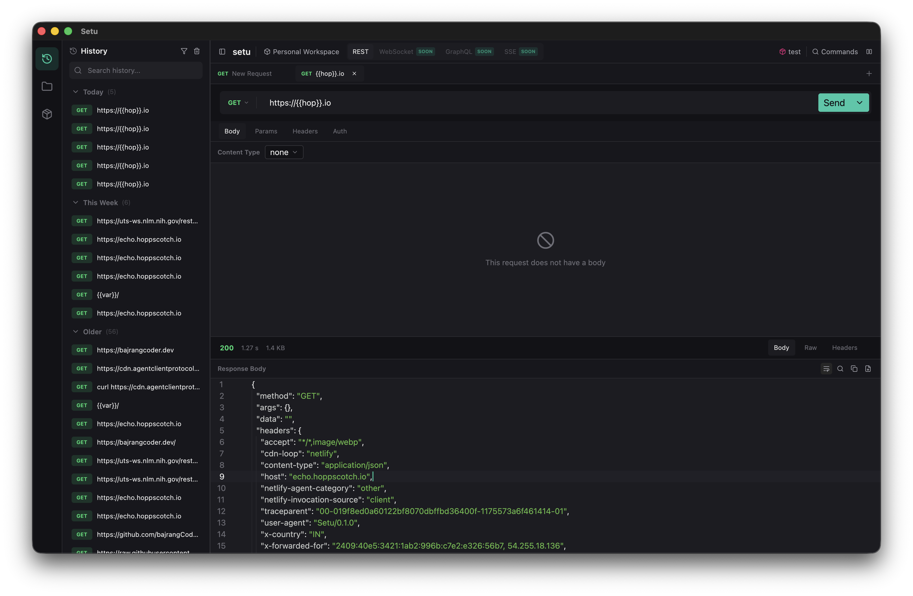
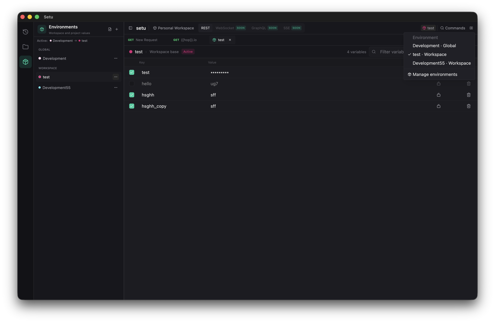
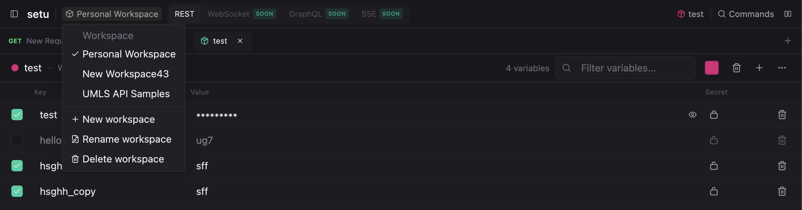

# Setu

> **Note:** This project is currently a **Work in Progress (WIP)**.

**Setu** is a modern, minimal, and high-performance API testing application built with Rust and [GPUI](https://gpui.rs).


## Demos

### 1. REST Client & Response Inspector



---

### 2. Environment & Variable Management



---

### 3. Multi-Workspace Container System



---

## Getting Started

### Prerequisites

- [Rust](https://www.rust-lang.org/tools/install) (Edition 2024 / Rust 1.91 or newer)

### Installation & Execution

1. **Clone the repository:**
   ```bash
   git clone https://github.com/bajrangCoder/setu.git
   cd setu
   ```

2. **Run in development mode:**
   ```bash
   cargo run
   ```

3. **Build release binary:**
   ```bash
   cargo build --release
   ```

## Usage Guide

### Working with Environments & Variables

1. Open **Environments** from the sidebar.
2. Select an environment layer (**Global**, **Workspace**, or **Project**).
3. Click **Add** or **New variable** to configure key-value entries.
4. Use variables across any request input field:
   ```text
   {{base_url}}/users
   Authorization: Bearer {{token}}
   ```
5. Type `{{` in any field to open the variable autocomplete popup.

### Managing Workspaces

- Click the workspace dropdown next to the Setu logo in the top toolbar.
- Switch, create, rename, or delete workspaces on the fly.
- Workspaces maintain isolated collections, request history, and active environments.

### Importing Postman Collections & Environments

- Click **Import Postman** in the Collections sidebar or the import icon in Environments.
- Select a Postman Collection JSON export to create a new workspace with all imported folders and requests.
- Select a Postman Environment JSON export to import enabled/disabled states and secret metadata into your active workspace.

## Keyboard Shortcuts

### Request Actions

| Shortcut | Action |
| :--- | :--- |
| <kbd>⌘</kbd> + <kbd>↵</kbd> / <kbd>⌃</kbd> + <kbd>↵</kbd> | Send Request |
| <kbd>⌘</kbd> + <kbd>N</kbd> | New Tab / Request |
| <kbd>⌘</kbd> + <kbd>D</kbd> | Duplicate Request |

### Tab Navigation

| Shortcut | Action |
| :--- | :--- |
| <kbd>⌃</kbd> + <kbd>Tab</kbd> | Next Tab |
| <kbd>⌘</kbd> + <kbd>Shift</kbd> + <kbd>]</kbd> / <kbd>⌥</kbd> + <kbd>⌘</kbd> + <kbd>→</kbd> | Next Tab |
| <kbd>⌃</kbd> + <kbd>Shift</kbd> + <kbd>Tab</kbd> | Previous Tab |
| <kbd>⌘</kbd> + <kbd>Shift</kbd> + <kbd>[</kbd> / <kbd>⌥</kbd> + <kbd>⌘</kbd> + <kbd>←</kbd> | Previous Tab |
| <kbd>⌘</kbd> + <kbd>W</kbd> | Close Tab |
| <kbd>⌘</kbd> + <kbd>Shift</kbd> + <kbd>W</kbd> | Close All Tabs |
| <kbd>⌘</kbd> + <kbd>Option</kbd> + <kbd>W</kbd> | Close Other Tabs |
| <kbd>⌘</kbd> + <kbd>1</kbd> ... <kbd>8</kbd> | Go to Tab 1–8 |
| <kbd>⌘</kbd> + <kbd>9</kbd> | Go to Last Tab |

### Panel Navigation

| Shortcut | Action |
| :--- | :--- |
| <kbd>⌘</kbd> + <kbd>L</kbd> / <kbd>⌘</kbd> + <kbd>U</kbd> | Focus URL Bar |
| <kbd>⌘</kbd> + <kbd>Shift</kbd> + <kbd>B</kbd> | Switch to Body Tab |
| <kbd>⌘</kbd> + <kbd>Shift</kbd> + <kbd>P</kbd> | Switch to Params Tab |
| <kbd>⌘</kbd> + <kbd>Shift</kbd> + <kbd>H</kbd> | Switch to Headers Tab |
| <kbd>⌘</kbd> + <kbd>Shift</kbd> + <kbd>A</kbd> | Switch to Auth Tab |
| <kbd>⌘</kbd> + <kbd>Option</kbd> + <kbd>B</kbd> | Switch to Response Body |
| <kbd>⌘</kbd> + <kbd>Option</kbd> + <kbd>H</kbd> | Switch to Response Headers |

### HTTP Method Hotkeys

| Shortcut | Method |
| :--- | :--- |
| <kbd>⌥</kbd> + <kbd>G</kbd> | `GET` |
| <kbd>⌥</kbd> + <kbd>P</kbd> | `POST` |
| <kbd>⌥</kbd> + <kbd>U</kbd> | `PUT` |
| <kbd>⌥</kbd> + <kbd>D</kbd> | `DELETE` |
| <kbd>⌥</kbd> + <kbd>A</kbd> | `PATCH` |
| <kbd>⌥</kbd> + <kbd>H</kbd> | `HEAD` |
| <kbd>⌥</kbd> + <kbd>O</kbd> | `OPTIONS` |

### Application Controls

| Shortcut | Action |
| :--- | :--- |
| <kbd>⌘</kbd> + <kbd>K</kbd> / <kbd>⌘</kbd> + <kbd>P</kbd> | Command Palette |
| <kbd>⌘</kbd> + <kbd>B</kbd> / <kbd>⌘</kbd> + <kbd>\</kbd> | Toggle Sidebar |
| <kbd>⌘</kbd> + <kbd>Q</kbd> | Quit Application |


## Roadmap

- [ ] Additional protocols: WebSocket, GraphQL, and SSE (Server-Sent Events)
- [ ] Export tools: cURL import/export, collection sharing
- [ ] Enhanced Auth: OAuth 2.0 flows, Digest Auth
- [ ] Cookie Jar & session persistence
- [ ] more..


## License

Distributed under the [MIT License](https://opensource.org/licenses/MIT).
